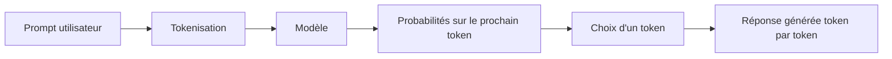
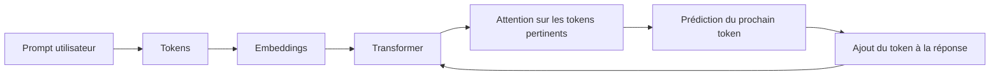

# Module 0 — Fondations de l'IA générative

## 🎯 Objectifs d'apprentissage

- Comprendre intuitivement comment fonctionne un LLM.
- Comprendre les rôles du **réseau de neurones**, du **pré-entraînement** et du **fine-tuning**.
- Savoir ce qu'est un **token** et pourquoi il compte autant.
- Situer les **embeddings**, le **Transformer** et l'**attention** dans la chaîne de traitement.
- Maîtriser les notions de **fenêtre de contexte**, **température** et **top-p**.
- Estimer un **coût** de requête ou de session agentique.
- Découvrir la notion de **plan** et les bases du **prompting**.

## ⏱️ Durée estimée

2 h 30 à 3 h 30.

## ✅ Prérequis

- Être à l'aise avec Python.
- Savoir ce qu'est une API HTTP, sans expertise particulière.

---

## 1. Un LLM, vu simplement

Un **LLM** (*Large Language Model*) est un moteur de prédiction du prochain token.
Il ne "pense" pas comme un humain : il observe une suite de tokens et prédit la suite
la plus plausible compte tenu de ce qu'il a appris.

### Ce que veut dire "modèle de langage"

- **Modèle** : un grand système de calcul, entraîné à reconnaître des régularités dans du texte.
- **Langage** : il travaille sur du texte découpé en **tokens**.
- **Grande taille** : il possède énormément de paramètres et a vu énormément d'exemples pendant son entraînement.

Dit autrement : un LLM est une machine qui a appris à compléter du texte de manière très convaincante.

### Analogie utile

Imagine un clavier de smartphone extraordinairement puissant :

- il ne connaît pas "la vérité" au sens humain ;
- il connaît des **régularités statistiques** dans des milliards d'exemples ;
- il produit souvent du texte convaincant, parfois exact, parfois faux.



### Pourquoi parle-t-on de réseau de neurones ?

Un LLM est un **réseau de neurones** : un grand ensemble de couches de calcul qui transforment progressivement des nombres en d'autres nombres.

Pas besoin d'entrer dans les maths pour l'intuition :

- le texte d'entrée est converti en nombres ;
- ces nombres traversent de nombreuses couches ;
- chaque couche affine la représentation de ce qui est en train d'être lu ;
- à la fin, le modèle produit une estimation du **prochain token** le plus plausible.

Tu peux voir cela comme une chaîne d'interprétation :

1. au début, le modèle voit surtout des morceaux de texte ;
2. au milieu, il capte des relations, des intentions, des structures ;
3. à la fin, il transforme cela en choix de continuation possible.

### Entraînement, pré-entraînement et fine-tuning

Un LLM ne naît pas "sachant" répondre. Il est entraîné en plusieurs phases.

#### Pré-entraînement

Le modèle lit une énorme quantité de texte et apprend surtout une chose :

> **prédire le token suivant**

Exemple très simplifié :

- entrée : `Le ciel est`
- cible attendue : ` bleu` ou une autre suite plausible selon le contexte

À force de répéter cet exercice à très grande échelle, le modèle apprend :

- des structures de phrases ;
- du vocabulaire ;
- des faits souvent présents dans les données ;
- des styles d'écriture ;
- des liens entre concepts.

#### Fine-tuning

Ensuite, on peut spécialiser le modèle pour mieux répondre à certains usages :

- suivre des instructions ;
- adopter un ton plus utile ;
- mieux répondre dans un domaine donné ;
- respecter des formats.

Le **pré-entraînement** donne une base générale.
Le **fine-tuning** ajuste le comportement pour un usage plus précis.

### Embeddings, Transformer et attention, sans maths lourdes

- Un **embedding** transforme un texte en coordonnées numériques qui capturent du sens.
  Deux phrases proches en sens auront souvent des vecteurs proches.
- Le **Transformer** est l'architecture qui permet au modèle d'analyser tous les tokens du contexte ensemble, plutôt qu'un par un de manière rigide.
- L'**attention** permet au modèle de décider quelles parties du contexte regarder plus
  fortement pour produire le prochain token.

> Idée clé : le LLM ne relit pas "également" tout ton prompt. Il pondère ce qui semble
> pertinent à chaque étape de génération.

### Modèle, prompt, contexte, réponse : bien distinguer les rôles

| Élément | Rôle |
|---------|------|
| **Modèle** | Le moteur entraîné qui sait prédire le prochain token |
| **Prompt** | La consigne ou question que tu envoies maintenant |
| **Contexte** | Tout ce qui est visible par le modèle à cet instant : consignes, historique, documents, résultats d'outils |
| **Réponse** | Le texte généré token par token par le modèle |

Autrement dit :

- ce que le modèle "sait" vient surtout de son **entraînement** ;
- ce qu'il fait ici et maintenant dépend du **prompt** et du **contexte** ;
- ce qu'il produit apparaît dans la **réponse**.

> ➡️ Si tu veux voir ce mécanisme en action sur un prompt concret, lis maintenant la
> section [2. Du prompt à la réponse : le trajet complet](#2-du-prompt-à-la-réponse--le-trajet-complet).

---

## 2. Du prompt à la réponse : le trajet complet

Prenons le prompt :

> `j'aimerai comprendre comment fonctionne un LLM`

Voici ce qui se passe, de façon pédagogique.

### Étape 1 — Tokenisation

Le texte n'entre pas directement "comme une phrase" dans le modèle.
Il est d'abord découpé en **tokens**.

Découpage intuitif possible :

```text
"j'"
"aimerai"
" comprendre"
" comment"
" fonctionne"
" un"
" L"
"LM"
```

Le découpage exact dépend du tokenizer du fournisseur.
L'idée importante est la suivante :

- un token n'est pas forcément un mot entier ;
- les espaces et morceaux de mots comptent ;
- `LLM` peut être un seul token... ou plusieurs.

### Étape 2 — Conversion en embeddings

Chaque token est transformé en **embedding**, c'est-à-dire en représentation numérique.

Le modèle ne "voit" pas :

```text
j'aimerai comprendre comment fonctionne un LLM
```

Il voit plutôt quelque chose comme :

```text
[vecteur 1] [vecteur 2] [vecteur 3] ...
```

Tu peux imaginer chaque embedding comme une fiche d'identité numérique d'un token :

- un peu de sa forme ;
- un peu de son usage ;
- un peu de son sens probable.

### Étape 3 — Passage dans le Transformer

Les embeddings passent ensuite dans les couches du **Transformer**.

Le rôle du Transformer est de construire progressivement une meilleure compréhension du contexte courant :

- `comprendre` signale une demande d'explication ;
- `comment fonctionne` signale une attente de mécanisme ;
- `LLM` indique le sujet technique ;
- l'ensemble de la phrase ressemble à une demande pédagogique.

### Étape 4 — Attention sur les parties importantes

Le mécanisme d'**attention** aide le modèle à déterminer quels tokens sont les plus utiles pour prédire la suite.

Dans notre exemple, au moment de commencer la réponse, il peut accorder beaucoup d'importance à :

- `comprendre`
- `fonctionne`
- `LLM`

Intuition : si tu réponds à cette phrase, tu ne donnes pas le même type de réponse que pour :

- `écris un poème sur un LLM`
- `compare deux LLM`
- `corrige cette phrase`

Le modèle "voit" donc que la bonne continuation ressemble probablement à :

- une explication ;
- en français ;
- orientée débutant si le contexte va dans ce sens.

### Étape 5 — Prédiction du prochain token

À la fin de ce premier passage, le modèle ne sort pas encore toute la réponse.
Il calcule d'abord :

> **quel est le prochain token le plus plausible ?**

Exemple fictif de candidats possibles :

| Token candidat | Intuition |
|----------------|-----------|
| `Un` | bonne ouverture pour une définition |
| `Pour` | bonne ouverture pour une explication pédagogique |
| `Bien` | possible si le ton est conversationnel |

Il choisit un token selon :

- les probabilités calculées ;
- les paramètres comme la **température** ;
- les éventuelles contraintes du système.

Supposons qu'il choisisse :

```text
Un
```

### Étape 6 — Boucle de génération

Le modèle recommence ensuite avec un nouveau contexte :

- le prompt initial ;
- **plus** le token déjà généré.

Le contexte devient, schématiquement :

```text
Utilisateur : j'aimerai comprendre comment fonctionne un LLM
Assistant : Un
```

Puis il prédit le token suivant, par exemple :

```text
 LLM
```

Puis :

```text
 est
```

Puis :

```text
 un
```

Et ainsi de suite, jusqu'à obtenir quelque chose comme :

```text
Un LLM est un modèle de langage entraîné à prédire le token suivant...
```

### Étape 7 — Construction progressive d'une réponse cohérente

La réponse finale est donc construite **petit morceau par petit morceau**.

Le modèle ne rédige pas toute la phrase "dans sa tête" avant de l'écrire.
Il avance itérativement :

1. il regarde tout le contexte disponible ;
2. il propose le prochain token ;
3. il ajoute ce token au contexte ;
4. il recommence.

### Mini schéma mental



### Ce que le modèle "sait" déjà et ce qu'il reçoit maintenant

Dans notre exemple, le modèle peut déjà avoir appris pendant l'entraînement :

- ce qu'est un LLM ;
- comment expliquer une notion ;
- le vocabulaire de base sur les modèles de langage.

Mais il ne devine pas tout seul ce que tu veux précisément.
Le **prompt** et le **contexte** lui indiquent :

- le sujet à traiter maintenant ;
- la langue ;
- le niveau de détail attendu ;
- les contraintes de ton ou de format si elles sont précisées.

### Mise au point : idées reçues à éviter

- **Le LLM ne comprend pas comme un humain** : il manipule des représentations apprises et des probabilités de continuation.
- **Il ne fait pas de magie hors contexte** : s'il manque des informations utiles, sa réponse se dégrade.
- **Il n'apprend pas pendant la conversation** : il utilise seulement le contexte qui lui est envoyé pendant l'appel.
- **Il peut sembler raisonner profondément** parce qu'il a appris beaucoup de structures de texte, d'explications et de résolutions de problèmes.
- **La qualité dépend de trois choses en même temps** : son entraînement, le contexte disponible et la manière dont on lui donne l'instruction.

> Bonne intuition à retenir : un LLM est moins un "cerveau qui sait tout" qu'un
> **générateur de suite plausible guidé par son entraînement et par le contexte présent**.

---

## 3. Tokens : l'unité qui gouverne tout

Un **token** n'est pas toujours un mot.
Selon le tokenizer, un token peut être :

- un mot entier ;
- un morceau de mot ;
- une ponctuation ;
- un espace ou un caractère spécial.

> 💡 Tu veux visualiser la tokenisation sur un vrai prompt ? Reprends l'exemple de la
> [section 2](#2-du-prompt-à-la-réponse--le-trajet-complet).

### Exemple intuitif

| Texte | Découpage intuitif probable | Pourquoi c'est utile |
|------|-----------------------------|------------------------|
| `Bonjour tout le monde !` | `Bonjour`, ` tout`, ` le`, ` monde`, ` !` | Un mot peut prendre plusieurs tokens selon le tokenizer |
| `authentication` | `auth`, `entication` ou autre découpe | Les mots techniques longs sont souvent découpés |
| `CI/CD` | `CI`, `/`, `CD` | Les symboles comptent aussi |

### Français vs anglais

Le français produit souvent **un peu plus de tokens** que l'anglais à contenu équivalent,
car les phrases peuvent être plus longues ou plus flexionnelles.

| Idée | Version française | Version anglaise | Observation |
|------|-------------------|------------------|-------------|
| Faire une revue de code | `Peux-tu relire cette fonction et proposer des tests ?` | `Can you review this function and suggest tests?` | La version FR a souvent un léger surcoût token |

> Règle pratique : compte en **ordre de grandeur**, pas au caractère près.

---

## 4. Fenêtre de contexte : la RAM du modèle

La **context window** correspond au nombre maximal de tokens visibles par le modèle à un instant donné.
Elle contient généralement :

- le **system prompt** ;
- l'historique de conversation ;
- les documents injectés ;
- les résultats de tools ;
- la réponse en cours de génération.

### Analogie

Pense à un tableau blanc de taille limitée :

- si tu écris trop de choses, tu dois effacer ;
- si tu gardes les mauvais éléments, le raisonnement se dégrade ;
- un agent qui appelle beaucoup d'outils consomme vite du contexte.

### Symptômes d'un contexte mal géré

- oublis de contraintes ;
- réponses contradictoires ;
- baisse de qualité au fil d'une longue session ;
- coûts qui explosent.

---

## 5. Température et top-p

Ces paramètres influencent la façon dont le modèle choisit les tokens.

| Paramètre | Effet principal | Usage conseillé |
|-----------|-----------------|-----------------|
| Température basse (0 à 0,3) | Réponses plus stables, plus déterministes | Code, résumés, extraction |
| Température moyenne (0,4 à 0,8) | Bon compromis | Rédaction générale |
| Température haute (0,9+) | Plus de variété, plus de risque | Brainstorming, idéation |
| Top-p | Limite la masse de probabilité considérée | À régler finement si tu sais pourquoi |

### Exemple d'effet

Prompt : `Propose trois noms pour un agent qui résume des pull requests.`

- **Température 0.1** → noms sobres et prévisibles.
- **Température 0.8** → noms plus variés, parfois plus créatifs.
- **Température 1.2** → peut devenir original… ou incohérent.

> En ingénierie logicielle, on préfère souvent la **fiabilité** à la créativité.

---

## 6. Tarification : input, output, abonnements et API

### 5.1 Deux mondes à distinguer

1. **Abonnement produit** : par exemple GitHub Copilot Free / Pro / Business / Enterprise,
   ou certaines offres Claude côté application.
2. **Facturation API à l'usage** : tu paies surtout des **tokens en entrée** et **en sortie**.

### 5.2 Tableau indicatif (ordre de grandeur)

> Les prix évoluent souvent. Vérifie toujours la documentation officielle avant un achat.

| Offre / modèle | Type de facturation | Entrée (≈ / 1M tokens) | Sortie (≈ / 1M tokens) |
|----------------|---------------------|-------------------------|--------------------------|
| GitHub Copilot | Abonnement | Non communiqué au token, usage inclus dans le plan | Non communiqué au token |
| Claude Haiku | API | ~0,8 $ | ~4 $ |
| Claude Sonnet | API | ~3 $ | ~15 $ |
| Claude Opus | API | ~15 $ | ~75 $ |
| OpenAI GPT-4.1 mini | API | ~0,4 $ | ~1,6 $ |
| OpenAI GPT-4.1 | API | ~2 $ | ~8 $ |

### 5.3 Formule simple

```text
coût = (tokens_input / 1_000_000 × prix_input)
     + (tokens_output / 1_000_000 × prix_output)
```

### 5.4 Exercice 1 — coût d'une requête

Tu envoies 12 000 tokens à un modèle à 3 $ / 1M en entrée et 15 $ / 1M en sortie.
Il renvoie 2 000 tokens.

**Question** : quel est le coût ?

<details>
<summary>Réponse</summary>

- Entrée : `12 000 / 1 000 000 × 3 = 0,036 $`
- Sortie : `2 000 / 1 000 000 × 15 = 0,03 $`
- **Total = 0,066 $**

</details>

### 5.5 Exercice 2 — coût d'une session agentique

Un agent :

- reçoit 8 000 tokens de consignes initiales ;
- fait 4 appels d'outils qui réinjectent chacun 3 000 tokens de résultats ;
- produit au total 5 000 tokens de réponse.

**Question** : combien de tokens d'entrée l'agent a-t-il consommés au minimum ?

<details>
<summary>Réponse</summary>

Minimum en entrée : `8 000 + (4 × 3 000) = 20 000 tokens`.
En pratique, c'est souvent **plus**, car l'historique et les pensées intermédiaires peuvent être renvoyés au modèle.

</details>

### 5.6 Pourquoi les agents coûtent plus cher que le chat simple

Parce qu'ils :

- itèrent ;
- relisent l'historique ;
- injectent les résultats des tools ;
- peuvent demander plusieurs tours avant la réponse finale.

---

## 7. La notion de plan

Un **plan** est une décomposition explicite d'une tâche en étapes.
C'est fondamental pour les agents parce que cela :

- réduit l'ambiguïté ;
- permet de choisir les bons tools ;
- améliore la traçabilité ;
- aide à interrompre ou valider un workflow.

### Exemple

Objectif : `Créer une issue GitHub à partir d'un bug observé en production.`

Plan possible :

1. Reformuler le bug.
2. Identifier contexte, impact, reproduction.
3. Proposer un titre d'issue.
4. Structurer description + critères d'acceptation.
5. Demander validation humaine avant publication.

> Un bon agent ne saute pas directement à l'action : il **structure**.

---

## 8. Prompting : les briques de base

### Zero-shot

Tu donnes une consigne sans exemple.

```text
Résume cette pull request en 5 puces orientées impact produit.
```

### Few-shot

Tu donnes un ou plusieurs exemples du format attendu.

```text
Voici deux exemples de bonnes revues de code. Applique le même format au diff suivant.
```

### Chain-of-thought

Tu encourages un raisonnement étape par étape.

```text
Analyse le problème en 3 étapes : compréhension, hypothèses, plan d'action.
```

### System prompt

Il fixe le rôle et les garde-fous.

```text
Tu es un agent de revue de code. Sois concis, cite les risques, n'invente pas de fichiers.
```

### Exercice de réécriture

Prompt initial :

```text
Fais-moi un agent pour les tests.
```

Version améliorée :

```text
Tu es un assistant Python spécialisé en pytest.
Objectif : proposer des tests unitaires pour une fonction pure.
Contraintes :
- ne change pas le code de production ;
- couvre cas nominal, bords et erreurs ;
- renvoie la réponse sous forme : hypothèses, liste des tests, code pytest.
```

---

## 9. Exemple Python simple : compter le coût d'une requête

```python
from dataclasses import dataclass


@dataclass
class Pricing:
    input_per_million: float
    output_per_million: float


def estimate_cost(input_tokens: int, output_tokens: int, pricing: Pricing) -> float:
    """Calcule un coût API approximatif en dollars."""
    input_cost = (input_tokens / 1_000_000) * pricing.input_per_million
    output_cost = (output_tokens / 1_000_000) * pricing.output_per_million
    return round(input_cost + output_cost, 6)


if __name__ == "__main__":
    sonnet = Pricing(input_per_million=3.0, output_per_million=15.0)
    print(estimate_cost(12_000, 2_000, sonnet))
```

---

## ✅ Auto-évaluation

1. Quelle différence entre un mot et un token ?
<details><summary>Réponse</summary>Un token est une unité du tokenizer ; un mot peut correspondre à un ou plusieurs tokens.</details>

2. À quoi sert un embedding ?
<details><summary>Réponse</summary>À représenter un token ou un texte sous forme numérique pour que le modèle puisse le manipuler et comparer des proximités de sens.</details>

3. Pourquoi une session agentique coûte-t-elle plus cher qu'une simple question ?
<details><summary>Réponse</summary>Parce qu'elle réinjecte historique, résultats d'outils et itérations supplémentaires.</details>

4. Quand utiliser une température basse ?
<details><summary>Réponse</summary>Pour les tâches de code, d'extraction, de synthèse fiable et de formatage strict.</details>

5. Que fait l'attention dans un LLM ?
<details><summary>Réponse</summary>Elle aide le modèle à pondérer les parties du contexte les plus utiles pour prédire le prochain token.</details>

6. Pourquoi écrire un plan avant d'agir ?
<details><summary>Réponse</summary>Pour décomposer la tâche, limiter les erreurs et rendre l'action vérifiable.</details>

7. Que fait un system prompt ?
<details><summary>Réponse</summary>Il fixe le rôle, les contraintes et les garde-fous globaux du modèle ou de l'agent.</details>

---

## ➡️ Module suivant

Passe au [Module 1 — Anatomie d'un agent](../module-1-agents/README.md).

> 💡 **Curiosité ?** Si tu veux comprendre dès maintenant pourquoi un LLM stateless
> donne l'illusion de mémoire, consulte la section dédiée du Module 1 :
> [Fonctionnement détaillé d'un agent](../module-1-agents/fonctionnement-detaille.md).
