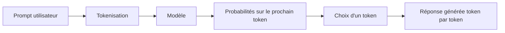

# Module 0 — Fondations de l'IA générative

## 🎯 Objectifs d'apprentissage

- Comprendre intuitivement comment fonctionne un LLM.
- Savoir ce qu'est un **token** et pourquoi il compte autant.
- Maîtriser les notions de **fenêtre de contexte**, **température** et **top-p**.
- Estimer un **coût** de requête ou de session agentique.
- Découvrir la notion de **plan** et les bases du **prompting**.

## ⏱️ Durée estimée

2 h 30 à 3 h 30.

## ✅ Prérequis

- Être à l'aise avec Python.
- Savoir ce qu'est une API HTTP, sans expertise particulière.

---

## 1. Un LLM, vu simplement

Un **LLM** (*Large Language Model*) est un moteur de prédiction du prochain token.
Il ne "pense" pas comme un humain : il observe une suite de tokens et prédit la suite
la plus plausible compte tenu de ce qu'il a appris.

### Analogie utile

Imagine un clavier de smartphone extraordinairement puissant :

- il ne connaît pas "la vérité" au sens humain ;
- il connaît des **régularités statistiques** dans des milliards d'exemples ;
- il produit souvent du texte convaincant, parfois exact, parfois faux.



### Embeddings et attention, sans maths lourdes

- Un **embedding** transforme un texte en coordonnées numériques qui capturent du sens.
  Deux phrases proches en sens auront souvent des vecteurs proches.
- L'**attention** permet au modèle de décider quelles parties du contexte regarder plus
  fortement pour produire le prochain token.

> Idée clé : le LLM ne relit pas "également" tout ton prompt. Il pondère ce qui semble
> pertinent à chaque étape de génération.

---

## 2. Tokens : l'unité qui gouverne tout

Un **token** n'est pas toujours un mot.
Selon le tokenizer, un token peut être :

- un mot entier ;
- un morceau de mot ;
- une ponctuation ;
- un espace ou un caractère spécial.

### Exemple intuitif

| Texte | Découpage intuitif probable | Pourquoi c'est utile |
|------|-----------------------------|------------------------|
| `Bonjour tout le monde !` | `Bonjour`, ` tout`, ` le`, ` monde`, ` !` | Un mot peut prendre plusieurs tokens selon le tokenizer |
| `authentication` | `auth`, `entication` ou autre découpe | Les mots techniques longs sont souvent découpés |
| `CI/CD` | `CI`, `/`, `CD` | Les symboles comptent aussi |

### Français vs anglais

Le français produit souvent **un peu plus de tokens** que l'anglais à contenu équivalent,
car les phrases peuvent être plus longues ou plus flexionnelles.

| Idée | Version française | Version anglaise | Observation |
|------|-------------------|------------------|-------------|
| Faire une revue de code | `Peux-tu relire cette fonction et proposer des tests ?` | `Can you review this function and suggest tests?` | La version FR a souvent un léger surcoût token |

> Règle pratique : compte en **ordre de grandeur**, pas au caractère près.

---

## 3. Fenêtre de contexte : la RAM du modèle

La **context window** correspond au nombre maximal de tokens visibles par le modèle à un instant donné.
Elle contient généralement :

- le **system prompt** ;
- l'historique de conversation ;
- les documents injectés ;
- les résultats de tools ;
- la réponse en cours de génération.

### Analogie

Pense à un tableau blanc de taille limitée :

- si tu écris trop de choses, tu dois effacer ;
- si tu gardes les mauvais éléments, le raisonnement se dégrade ;
- un agent qui appelle beaucoup d'outils consomme vite du contexte.

### Symptômes d'un contexte mal géré

- oublis de contraintes ;
- réponses contradictoires ;
- baisse de qualité au fil d'une longue session ;
- coûts qui explosent.

---

## 4. Température et top-p

Ces paramètres influencent la façon dont le modèle choisit les tokens.

| Paramètre | Effet principal | Usage conseillé |
|-----------|-----------------|-----------------|
| Température basse (0 à 0,3) | Réponses plus stables, plus déterministes | Code, résumés, extraction |
| Température moyenne (0,4 à 0,8) | Bon compromis | Rédaction générale |
| Température haute (0,9+) | Plus de variété, plus de risque | Brainstorming, idéation |
| Top-p | Limite la masse de probabilité considérée | À régler finement si tu sais pourquoi |

### Exemple d'effet

Prompt : `Propose trois noms pour un agent qui résume des pull requests.`

- **Température 0.1** → noms sobres et prévisibles.
- **Température 0.8** → noms plus variés, parfois plus créatifs.
- **Température 1.2** → peut devenir original… ou incohérent.

> En ingénierie logicielle, on préfère souvent la **fiabilité** à la créativité.

---

## 5. Tarification : input, output, abonnements et API

### 5.1 Deux mondes à distinguer

1. **Abonnement produit** : par exemple GitHub Copilot Free / Pro / Business / Enterprise,
   ou certaines offres Claude côté application.
2. **Facturation API à l'usage** : tu paies surtout des **tokens en entrée** et **en sortie**.

### 5.2 Tableau indicatif (ordre de grandeur)

> Les prix évoluent souvent. Vérifie toujours la documentation officielle avant un achat.

| Offre / modèle | Type de facturation | Entrée (≈ / 1M tokens) | Sortie (≈ / 1M tokens) |
|----------------|---------------------|-------------------------|--------------------------|
| GitHub Copilot | Abonnement | Non communiqué au token, usage inclus dans le plan | Non communiqué au token |
| Claude Haiku | API | ~0,8 $ | ~4 $ |
| Claude Sonnet | API | ~3 $ | ~15 $ |
| Claude Opus | API | ~15 $ | ~75 $ |
| OpenAI GPT-4.1 mini | API | ~0,4 $ | ~1,6 $ |
| OpenAI GPT-4.1 | API | ~2 $ | ~8 $ |

### 5.3 Formule simple

```text
coût = (tokens_input / 1_000_000 × prix_input)
     + (tokens_output / 1_000_000 × prix_output)
```

### 5.4 Exercice 1 — coût d'une requête

Tu envoies 12 000 tokens à un modèle à 3 $ / 1M en entrée et 15 $ / 1M en sortie.
Il renvoie 2 000 tokens.

**Question** : quel est le coût ?

<details>
<summary>Réponse</summary>

- Entrée : `12 000 / 1 000 000 × 3 = 0,036 $`
- Sortie : `2 000 / 1 000 000 × 15 = 0,03 $`
- **Total = 0,066 $**

</details>

### 5.5 Exercice 2 — coût d'une session agentique

Un agent :

- reçoit 8 000 tokens de consignes initiales ;
- fait 4 appels d'outils qui réinjectent chacun 3 000 tokens de résultats ;
- produit au total 5 000 tokens de réponse.

**Question** : combien de tokens d'entrée l'agent a-t-il consommés au minimum ?

<details>
<summary>Réponse</summary>

Minimum en entrée : `8 000 + (4 × 3 000) = 20 000 tokens`.
En pratique, c'est souvent **plus**, car l'historique et les pensées intermédiaires peuvent être renvoyés au modèle.

</details>

### 5.6 Pourquoi les agents coûtent plus cher que le chat simple

Parce qu'ils :

- itèrent ;
- relisent l'historique ;
- injectent les résultats des tools ;
- peuvent demander plusieurs tours avant la réponse finale.

---

## 6. La notion de plan

Un **plan** est une décomposition explicite d'une tâche en étapes.
C'est fondamental pour les agents parce que cela :

- réduit l'ambiguïté ;
- permet de choisir les bons tools ;
- améliore la traçabilité ;
- aide à interrompre ou valider un workflow.

### Exemple

Objectif : `Créer une issue GitHub à partir d'un bug observé en production.`

Plan possible :

1. Reformuler le bug.
2. Identifier contexte, impact, reproduction.
3. Proposer un titre d'issue.
4. Structurer description + critères d'acceptation.
5. Demander validation humaine avant publication.

> Un bon agent ne saute pas directement à l'action : il **structure**.

---

## 7. Prompting : les briques de base

### Zero-shot

Tu donnes une consigne sans exemple.

```text
Résume cette pull request en 5 puces orientées impact produit.
```

### Few-shot

Tu donnes un ou plusieurs exemples du format attendu.

```text
Voici deux exemples de bonnes revues de code. Applique le même format au diff suivant.
```

### Chain-of-thought

Tu encourages un raisonnement étape par étape.

```text
Analyse le problème en 3 étapes : compréhension, hypothèses, plan d'action.
```

### System prompt

Il fixe le rôle et les garde-fous.

```text
Tu es un agent de revue de code. Sois concis, cite les risques, n'invente pas de fichiers.
```

### Exercice de réécriture

Prompt initial :

```text
Fais-moi un agent pour les tests.
```

Version améliorée :

```text
Tu es un assistant Python spécialisé en pytest.
Objectif : proposer des tests unitaires pour une fonction pure.
Contraintes :
- ne change pas le code de production ;
- couvre cas nominal, bords et erreurs ;
- renvoie la réponse sous forme : hypothèses, liste des tests, code pytest.
```

---

## 8. Exemple Python simple : compter le coût d'une requête

```python
from dataclasses import dataclass


@dataclass
class Pricing:
    input_per_million: float
    output_per_million: float


def estimate_cost(input_tokens: int, output_tokens: int, pricing: Pricing) -> float:
    """Calcule un coût API approximatif en dollars."""
    input_cost = (input_tokens / 1_000_000) * pricing.input_per_million
    output_cost = (output_tokens / 1_000_000) * pricing.output_per_million
    return round(input_cost + output_cost, 6)


if __name__ == "__main__":
    sonnet = Pricing(input_per_million=3.0, output_per_million=15.0)
    print(estimate_cost(12_000, 2_000, sonnet))
```

---

## ✅ Auto-évaluation

1. Quelle différence entre un mot et un token ?
<details><summary>Réponse</summary>Un token est une unité du tokenizer ; un mot peut correspondre à un ou plusieurs tokens.</details>

2. Pourquoi une session agentique coûte-t-elle plus cher qu'une simple question ?
<details><summary>Réponse</summary>Parce qu'elle réinjecte historique, résultats d'outils et itérations supplémentaires.</details>

3. Quand utiliser une température basse ?
<details><summary>Réponse</summary>Pour les tâches de code, d'extraction, de synthèse fiable et de formatage strict.</details>

4. Pourquoi écrire un plan avant d'agir ?
<details><summary>Réponse</summary>Pour décomposer la tâche, limiter les erreurs et rendre l'action vérifiable.</details>

5. Que fait un system prompt ?
<details><summary>Réponse</summary>Il fixe le rôle, les contraintes et les garde-fous globaux du modèle ou de l'agent.</details>

---

## ➡️ Module suivant

Passe au [Module 1 — Anatomie d'un agent](../module-1-agents/README.md).

> 💡 **Curiosité ?** Si tu veux comprendre dès maintenant pourquoi un LLM stateless
> donne l'illusion de mémoire, consulte la section dédiée du Module 1 :
> [Fonctionnement détaillé d'un agent](../module-1-agents/fonctionnement-detaille.md).
