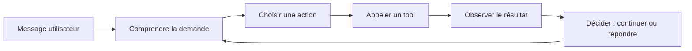

# Module 1 — Anatomie d'un agent

## 🎯 Objectifs d'apprentissage

- Distinguer **LLM**, **assistant** et **agent**.
- Comprendre la boucle **ReAct**.
- Savoir ce qu'est un **tool** et comment fonctionne le **function calling**.
- Comprendre la mémoire court terme / long terme et le **RAG**.
- Découvrir l'orchestration de **sous-agents**.

## ⏱️ Durée estimée

2 h 30 à 3 h.

## ✅ Prérequis

- Avoir parcouru le [Module 0](../module-0-fondations/README.md).
- Connaître les bases d'une fonction Python.

---

## 1. LLM vs assistant vs agent

| Niveau | Définition | Exemple |
|--------|------------|---------|
| LLM | Modèle qui génère du texte | Un endpoint API Claude ou OpenAI |
| Assistant | LLM + consignes + interface | Chat Copilot, Claude Desktop |
| Agent | Assistant capable de planifier et d'agir via des tools | Agent de code, agent de ticketing |

### Analogie

- Le **LLM** = le moteur.
- L'**assistant** = la voiture avec tableau de bord.
- L'**agent** = le conducteur qui peut lire la carte, choisir une action et utiliser des outils.

---

## 2. La boucle agentique / ReAct

Un agent suit souvent une boucle proche de **ReAct** (*Reason + Act*).

```text
Perception -> Raisonnement -> Action -> Observation -> nouvelle perception
```



### Exemple concret

Demande : `Lis les logs CI et dis-moi pourquoi le build échoue.`

L'agent peut :

1. planifier ;
2. appeler un tool pour récupérer les logs ;
3. repérer la stack trace ;
4. demander un second tool pour ouvrir le fichier fautif ;
5. proposer un diagnostic.

> Sans tools, il ne peut que **deviner**. Avec tools, il peut **observer**.

---

## 3. Tools et function calling

Un **tool** est une capacité externe : lire un fichier, appeler une API météo,
créer une issue, lancer des tests, interroger une base, etc.

### Schéma mental

```text
LLM -> "j'ai besoin d'un outil" -> appel structuré -> résultat -> nouveau raisonnement
```

### Exemple Python minimal avec Anthropic

> Clé API requise dans `ANTHROPIC_API_KEY`. Ne jamais la mettre en dur.

```python
import json
import os
from anthropic import Anthropic


def get_weather(city: str) -> dict:
    """Tool maison : ici on renvoie une réponse mockée pour la démo."""
    samples = {
        "Paris": {"city": "Paris", "temperature": 22, "condition": "ensoleillé"},
        "Lyon": {"city": "Lyon", "temperature": 19, "condition": "nuageux"},
    }
    return samples.get(city, {"city": city, "temperature": 0, "condition": "inconnu"})


client = Anthropic(api_key=os.environ["ANTHROPIC_API_KEY"])

tools = [
    {
        "name": "get_weather",
        "description": "Retourne une météo simplifiée pour une ville.",
        "input_schema": {
            "type": "object",
            "properties": {"city": {"type": "string"}},
            "required": ["city"],
        },
    }
]

response = client.messages.create(
    model="claude-sonnet-4-5",
    max_tokens=300,
    tools=tools,
    messages=[{"role": "user", "content": "Quel temps fait-il à Paris ?"}],
)

for block in response.content:
    if block.type == "tool_use" and block.name == "get_weather":
        result = get_weather(block.input["city"])
        print(json.dumps(result, ensure_ascii=False, indent=2))
```

### Ce qu'il faut retenir

- le modèle **ne lance pas directement ton code** ;
- il propose un appel structuré ;
- ton application décide si elle exécute ou non ce tool ;
- tu dois valider les entrées et contrôler les permissions.

---

## 4. Mémoire : court terme et long terme

### Court terme

C'est le **contexte actuel** : historique, pièces jointes, sorties d'outils, plan courant.

### Long terme

C'est une mémoire externe :

- base de connaissances ;
- base vectorielle ;
- fichiers ;
- CRM, wiki, base incidents, etc.

> Un agent sans mémoire long terme ressemble à un très bon stagiaire qui oublie tout entre deux réunions.

---

## 5. RAG : Retrieval Augmented Generation

Le **RAG** consiste à :

1. transformer des documents en embeddings ;
2. stocker ces vecteurs ;
3. retrouver les passages proches de la question ;
4. injecter ces passages dans le prompt.

### Exemple d'usage ingénierie

Question : `Quelle est la convention de nommage des branches dans ce repo ?`

L'agent ne doit pas inventer. Il récupère la convention dans la documentation, puis répond.

### Bénéfices

- moins d'hallucinations ;
- réponses ancrées dans une source ;
- meilleure actualisation que le seul entraînement du modèle.

### Limites

- si la recherche retrouve de mauvais passages, la réponse sera mauvaise ;
- un contexte trop chargé peut dégrader la synthèse ;
- le RAG n'est pas une permission magique : il faut toujours filtrer les accès.

---

## 6. Sous-agents et orchestration multi-agents

Un **sous-agent** est un agent spécialisé dans une sous-tâche.

### Pattern courant

- **Superviseur** : comprend la demande globale.
- **Workers** : exécutent des tâches spécialisées.

```text
Demande utilisateur
  -> Superviseur
      -> Worker analyse
      -> Worker tests
      -> Worker sécurité
  -> Synthèse finale
```

### Quand c'est utile

- tâches longues ou hétérogènes ;
- besoin d'isoler les responsabilités ;
- volonté de limiter le contexte de chaque agent.

### Quand ce n'est pas utile

- si un simple prompt suffit ;
- si la coordination coûte plus cher que le travail ;
- si tu n'as pas de moyen d'observer ou de tester chaque agent.

---

## 7. Mini check-list de conception d'agent

Avant d'écrire du code, pose-toi ces questions :

1. Quel est l'objectif exact ?
2. Quels tools sont nécessaires ?
3. Quelles permissions minimales ?
4. Quel format de sortie ?
5. Qu'est-ce qui doit être validé par un humain ?
6. Comment tracer les actions ?

---

## 8. Exemple Python : mémoire long terme simplifiée

```python
knowledge_base = {
    "pytest": "Framework de tests Python très utilisé pour les tests unitaires.",
    "mcp": "Protocole standard pour exposer tools, resources et prompts à un agent.",
}


def retrieve(topic: str) -> str:
    """Version ultra simple d'une recherche de connaissance."""
    return knowledge_base.get(topic.lower(), "Aucune information trouvée.")


print(retrieve("mcp"))
```

---

## ✅ Auto-évaluation

1. Qu'apporte un agent par rapport à un simple assistant ?
<details><summary>Réponse</summary>Il peut planifier, appeler des tools, observer leurs résultats et boucler jusqu'à l'objectif.</details>

2. Pourquoi parle-t-on de ReAct ?
<details><summary>Réponse</summary>Parce que l'agent alterne raisonnement et action au lieu de seulement générer du texte.</details>

3. Un tool est-il exécuté automatiquement par le LLM ?
<details><summary>Réponse</summary>Non. Le modèle propose un appel, puis l'application hôte décide de l'exécuter.</details>

4. Quelle différence entre mémoire court terme et long terme ?
<details><summary>Réponse</summary>La mémoire court terme vit dans le contexte courant ; la mémoire long terme est stockée dans un système externe.</details>

5. Pourquoi utiliser des sous-agents ?
<details><summary>Réponse</summary>Pour spécialiser les tâches, réduire le contexte et améliorer la lisibilité d'une orchestration complexe.</details>

---

## ➡️ Module suivant

Passe au [Module 2 — Le protocole MCP](../module-2-mcp/README.md).
