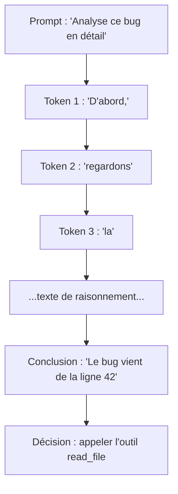
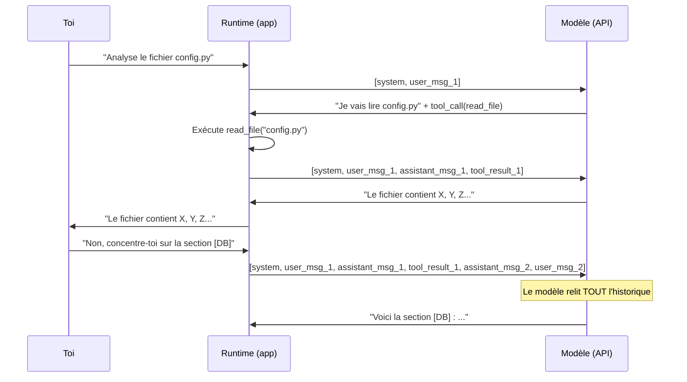
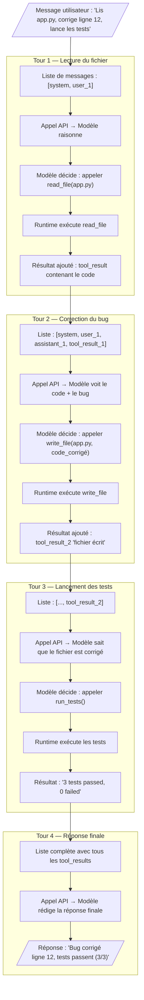

# 🔍 Comment un agent fonctionne dans le détail

> Ce document approfondit le Module 1 pour répondre à la question :
> **"Comment un simple modèle de prédiction de texte produit-il des raisonnements
> aussi poussés, et comment 'se souvient-il' de mes corrections ?"**

---

## 1. Du LLM au raisonnement — démystifier la "magie"

### 1.1 Un LLM ne fait que prédire le prochain token… et c'est suffisant

Un LLM est entraîné sur des milliards de documents. Parmi eux : des mathématiques, du
code, des raisonnements scientifiques, des débats philosophiques. Il a donc appris **à
imiter les patterns de raisonnement humain** — pas à "penser" comme un humain.

```text
Texte en entrée : "Analysons le problème en 3 étapes. Étape 1 :"
                          ↓
Le modèle prédit la suite la plus plausible compte tenu de son entraînement
                          ↓
"…identifier la contrainte principale, Étape 2 : …"
```

Le raisonnement n'est pas une capacité séparée : c'est une **émergence** de la prédiction
de texte appliquée à des textes qui raisonnent.

### 1.2 Pourquoi "pense-t-il plus" avec chain-of-thought ?

Quand tu écrits `"Réfléchis étape par étape"` ou que l'agent génère un `<thinking>`,
il **produit du texte de raisonnement intermédiaire**. Ce texte devient ensuite
**lui-même du contexte** qui oriente les prédictions suivantes.



> **Idée clé** : le LLM ne "pense" pas entre deux messages. Tout se joue dans le texte
> du contexte. Plus le contexte contient du raisonnement de qualité, meilleure est la suite.

### 1.3 Ce que fait la boucle agentique en plus du modèle "brut"

| Ce que fait le LLM seul | Ce qu'ajoute la boucle agentique |
|-------------------------|----------------------------------|
| Génère du texte | Exécute les tools proposés |
| Prédit le prochain token | Gère l'historique de messages |
| Peut simuler un raisonnement | Boucle jusqu'à l'objectif atteint |
| Ne fait "rien" entre deux appels | Injecte les résultats de tools dans le contexte |
| Stateless (sans état) | Maintient l'état via la liste de messages |

---

## 2. La mémoire du chat démystifiée — le modèle est stateless

### 2.1 Vérité fondamentale : le modèle ne se souvient de rien

Entre deux requêtes API, le modèle **ne garde aucune information**. Il est comme un moteur
qui s'éteint et redémarre à chaque appel. C'est ce qu'on appelle **stateless** (sans état).

### 2.2 Alors comment "se souvient-il" de tout ce qu'il a fait ?

La réponse est simple : **tout l'historique de la conversation est renvoyé à chaque tour**
dans la liste de messages. Le modèle ne se "souvient" pas — il **relit tout à chaque fois**.



### 2.3 Exemple JSON concret — la liste de messages qui grossit

Voici la liste de messages telle qu'elle est envoyée au modèle à chaque tour.

**Tour 1 — demande initiale :**

```json
[
  {
    "role": "system",
    "content": "Tu es un agent de revue de code. Lis les fichiers et identifie les bugs."
  },
  {
    "role": "user",
    "content": "Lis le fichier config.py et corrige les bugs que tu trouves."
  }
]
```

**Après le tour 1 — le modèle appelle un tool :**

```json
[
  {
    "role": "system",
    "content": "Tu es un agent de revue de code. Lis les fichiers et identifie les bugs."
  },
  {
    "role": "user",
    "content": "Lis le fichier config.py et corrige les bugs que tu trouves."
  },
  {
    "role": "assistant",
    "content": [
      {
        "type": "text",
        "text": "Je vais commencer par lire le fichier config.py."
      },
      {
        "type": "tool_use",
        "id": "tool_abc123",
        "name": "read_file",
        "input": { "path": "config.py" }
      }
    ]
  },
  {
    "role": "user",
    "content": [
      {
        "type": "tool_result",
        "tool_use_id": "tool_abc123",
        "content": "DB_HOST = 'localhost'\nDB_PORT = '5432'\nDB_PASS = 'admin123'  # BUG: secret en dur !"
      }
    ]
  }
]
```

**Tour 2 — l'utilisateur corrige l'agent :**

```json
[
  { "role": "system", "content": "..." },
  { "role": "user", "content": "Lis le fichier config.py et corrige les bugs..." },
  { "role": "assistant", "content": "J'ai trouvé un secret en dur dans DB_PASS." },
  { "role": "user", "content": "Non, concentre-toi aussi sur les types : DB_PORT devrait être un int, pas une string." },
  { "role": "assistant", "content": "..." }
]
```

> **Ce que fait la correction** : le message de correction s'ajoute à la liste et le modèle
> le relit comme **une nouvelle instruction qui prend le dessus**. C'est pour ça que
> l'agent "intègre" ta correction : il la voit dans son contexte.

### 2.4 Les limites : fenêtre de contexte et troncature

| Limite | Description | Conséquence |
|--------|-------------|-------------|
| **Fenêtre de contexte** | Maximum de tokens visibles (ex. 200k pour Claude) | Au-delà, messages anciens perdus |
| **Troncature** | Les messages les plus anciens sont supprimés | L'agent "oublie" les premières instructions |
| **Résumé/compression** | Certains runtimes résument l'historique avant troncature | Perte de détails, mais conservation du sens |
| **Entre deux sessions** | La liste de messages repart de zéro | L'agent ne se souvient pas de la session précédente |

> ⚠️ Si ton agent semble oublier des contraintes importantes au fil d'une longue session,
> c'est souvent dû à la troncature. Remets les contraintes critiques dans le system prompt.

---

## 3. Trace pas à pas d'un tour agentique complet

### 3.1 La demande

Supposons que l'utilisateur demande : **"Lis le fichier `app.py`, corrige le bug à la
ligne 12, puis lance les tests."**

### 3.2 Schéma de la boucle complète



### 3.3 Le contexte à chaque étape — vue détaillée

**Étape 0 — Contexte initial (avant le 1er appel API) :**

```text
Messages envoyés au modèle :
├── [system]    "Tu es un agent de code. Tu peux lire/écrire des fichiers et lancer des tests."
└── [user]      "Lis app.py, corrige le bug à la ligne 12, puis lance les tests."

Taille : ~60 tokens
```

**Étape 1 — Après le 1er appel (modèle décide de lire le fichier) :**

```text
Messages envoyés au modèle :
├── [system]    "Tu es un agent de code..."
├── [user]      "Lis app.py, corrige le bug..."
├── [assistant] "Je vais d'abord lire app.py." + tool_use(read_file, "app.py")
└── [tool]      "def calculate(a, b):\n    return a / b  # BUG: pas de garde contre b=0"

Taille : ~200 tokens  ← le contexte a grandi
```

**Étape 2 — Après la correction (modèle a écrit le fichier corrigé) :**

```text
Messages envoyés au modèle :
├── [system]    "..."
├── [user]      "Lis app.py, corrige le bug..."
├── [assistant] "Je vais lire app.py." + tool_use(read_file)
├── [tool]      "def calculate(a, b):\n    return a / b  # BUG: ..."
├── [assistant] "Trouvé : division par zéro possible. Je corrige." + tool_use(write_file)
└── [tool]      "Fichier écrit avec succès."

Taille : ~350 tokens  ← le contexte continue de grossir
```

**Étape 3 — Après les tests :**

```text
Messages envoyés au modèle :
├── [system]    "..."
├── [user]      "..."
├── [assistant] "Je vais lire app.py." + tool_use(read_file)
├── [tool]      "def calculate(a, b):\n    return a / b  # BUG: ..."
├── [assistant] "Trouvé : division par zéro. Je corrige." + tool_use(write_file)
├── [tool]      "Fichier écrit avec succès."
├── [assistant] "Tests lancés." + tool_use(run_tests)
└── [tool]      "3 tests passed. 0 failed."

Taille : ~500 tokens  ← le modèle a maintenant TOUT le contexte pour répondre
```

> **Observation** : le modèle ne fait rien entre les étapes. Il est appelé **à chaque tour**
> et voit à chaque fois **toute la liste de messages depuis le début**.

---

## 4. Exemple Python exécutable — observer le contexte qui grandit

Le script suivant simule la boucle agentique et **logue à chaque tour la liste complète
de messages** pour que tu puisses observer concrètement le mécanisme.

> Fichier : [`exemples/boucle_agentique.py`](./exemples/boucle_agentique.py)

```python
# Voir le fichier exemples/boucle_agentique.py pour le code complet et exécutable
```

**Pour lancer l'exemple :**

```bash
# Installer les dépendances
pip install anthropic

# Configurer la clé API (jamais en dur dans le code !)
export ANTHROPIC_API_KEY="sk-ant-..."

# Lancer
python module-1-agents/exemples/boucle_agentique.py
```

**Ce que tu observeras dans les logs :**

```text
=== Tour 1 — Liste de messages envoyée au modèle ===
Nombre de messages : 2
[0] system   : "Tu es un agent de code..."
[1] user     : "Lis config.py, trouve les problèmes et corrige-les."
──────────────────────────────────────────────
Réponse : tool_use → read_file("config.py")

=== Tour 2 — Liste de messages envoyée au modèle ===
Nombre de messages : 4
[0] system   : "Tu es un agent de code..."
[1] user     : "Lis config.py, trouve les problèmes et corrige-les."
[2] assistant: [text + tool_use read_file]
[3] tool     : "PORT = '8080'  # devrait être un int\nDEBUG = True  # à désactiver en prod"
──────────────────────────────────────────────
Réponse : "J'ai trouvé 2 problèmes : PORT est une chaîne (devrait être int)..."
```

---

## 5. Encadré — Idées reçues à déconstruire

> 🧠 **Idée reçue n°1 : "Le modèle apprend de notre conversation"**
>
> **Réalité** : non. Le modèle ne se met pas à jour en temps réel. Il n'y a pas de
> fine-tuning pendant une session de chat. Il *utilise* la conversation comme contexte,
> mais ses poids (paramètres) restent identiques. Ta correction n'améliore pas le modèle
> de façon permanente.

---

> 🧠 **Idée reçue n°2 : "L'agent garde mes préférences entre deux sessions"**
>
> **Réalité** : non, sauf si un mécanisme explicite de mémoire externe est mis en place
> (ex. écriture dans un fichier, une base de données, des `memories` dans l'interface
> de Claude). Entre deux sessions, la liste de messages repart de zéro.

---

> 🧠 **Idée reçue n°3 : "Le modèle pense en permanence en arrière-fond"**
>
> **Réalité** : non. Le modèle est appelé à la demande. Entre deux appels API, il ne fait
> rien. Il n'y a pas de processus en cours d'exécution qui "réfléchit" entre les tours.

---

> 🧠 **Idée reçue n°4 : "Plus il génère de texte, plus il est intelligent"**
>
> **Réalité** : la longueur du raisonnement intermédiaire peut améliorer la qualité
> (chain-of-thought), mais ce n'est pas automatique. Un raisonnement long et circulaire
> peut au contraire dégrader la réponse finale.

---

> 🧠 **Idée reçue n°5 : "L'historique du chat est stocké côté serveur"**
>
> **Réalité** : c'est l'application (Claude Desktop, VS Code Copilot, ton script Python)
> qui maintient et renvoie l'historique. L'API Anthropic ou OpenAI ne stocke pas l'état de
> ta conversation entre les requêtes — sauf via des fonctionnalités explicites de threads.

---

## ✅ Auto-évaluation

1. Pourquoi un LLM "stateless" donne-t-il l'illusion de se souvenir ?
<details><summary>Réponse</summary>Parce que le runtime (l'application) renvoie tout l'historique de messages à chaque appel API. Le modèle "relit" tout à chaque tour.</details>

2. Qu'est-ce qu'un `tool_result` dans la liste de messages ?
<details><summary>Réponse</summary>C'est le résultat renvoyé par l'exécution d'un tool, ajouté au contexte après que le runtime a exécuté l'appel proposé par le modèle.</details>

3. Si tu corriges l'agent en cours de session, comment le modèle en tient-il compte ?
<details><summary>Réponse</summary>Ton message de correction est ajouté à la liste de messages et renvoyé au modèle au prochain tour. Le modèle le "lit" comme une nouvelle instruction.</details>

4. Que se passe-t-il quand la liste de messages dépasse la fenêtre de contexte ?
<details><summary>Réponse</summary>Les messages les plus anciens sont tronqués ou résumés. L'agent peut alors "oublier" des contraintes définies tôt dans la conversation.</details>

5. Pourquoi les sessions agentiques coûtent-elles plus cher à chaque tour ?
<details><summary>Réponse</summary>Parce que la liste de messages grossit à chaque tour (nouveaux messages + tool results), et que tous ces tokens sont renvoyés en entrée à chaque appel API.</details>

---

## ➡️ Pour aller plus loin

- [Module 0 — Fondations](../module-0-fondations/README.md) : fenêtre de contexte, tarification
- [Module 1 — Anatomie d'un agent](./README.md) : la boucle ReAct complète
- [TP1 — Premier agent](../module-4-tps/tp1/README.md) : code à la main
