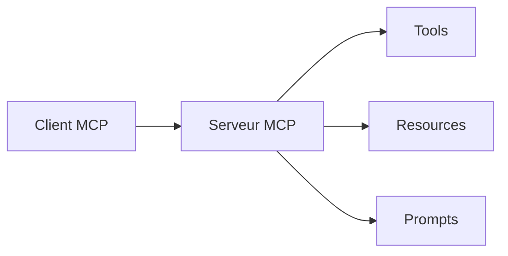

# Module 2 — Le protocole MCP (Model Context Protocol)

## 🎯 Objectifs d'apprentissage

- Comprendre ce qu'est **MCP** et pourquoi ce protocole existe.
- Identifier les rôles : **client**, **serveur**, **resources**, **tools**, **prompts**.
- Lire et écrire un **serveur MCP minimal en Python**.
- Savoir comment brancher MCP dans Claude et dans un environnement orienté Copilot / VS Code.

## ⏱️ Durée estimée

2 h à 2 h 30.

## ✅ Prérequis

- Avoir parcouru les modules 0 et 1.
- Connaître les bases d'un programme Python en ligne de commande.

---

## 1. Pourquoi MCP existe

Avant MCP, chaque assistant utilisait son propre format pour connecter des outils externes.
Résultat : beaucoup d'adaptateurs spécifiques et peu d'interopérabilité.

**MCP** propose un langage commun entre :

- un **client** (ex. application agentique, desktop app, IDE) ;
- un **serveur** (qui expose des capacités) ;
- des objets standardisés : **tools**, **resources**, **prompts**.

### Analogie

MCP joue un rôle proche de l'USB-C dans le matériel :

- tout ne fait pas la même chose ;
- mais tout parle un **protocole commun**.

---

## 2. Vue d'ensemble de l'architecture



### Définitions rapides

- **Client** : application qui consomme MCP.
- **Serveur** : programme qui expose des capacités.
- **Tool** : action exécutable (ex. `run_sql`, `read_git_status`).
- **Resource** : donnée ou document consultable.
- **Prompt** : gabarit réutilisable pour cadrer une tâche.

---

## 3. Cas d'usage en ingénierie logicielle

MCP est utile quand tu veux connecter un agent à :

- Git / GitHub ;
- une base de données ;
- une API interne ;
- une documentation technique ;
- un registre d'incidents ;
- des outils qualité (tests, CI, sécurité).

### Exemples

- `git_status` : expose l'état d'un dépôt ;
- `read_release_notes` : lit une note de version ;
- `search_runbooks` : retourne un runbook de production ;
- `create_issue_preview` : prépare une issue sans la publier directement.

---

## 4. Exemple de serveur MCP minimal en Python

> Dépendance : `mcp` dans [`requirements.txt`](../requirements.txt). Aucune clé secrète en dur.

```python
from mcp.server.fastmcp import FastMCP

mcp = FastMCP("release-notes-server")

RELEASE_NOTES = {
    "1.0.0": "Première version stable.",
    "1.1.0": "Ajout du mode batch pour les agents.",
}


@mcp.tool()
def read_release_notes(version: str) -> str:
    """Retourne la note de version pour une version donnée."""
    return RELEASE_NOTES.get(version, "Version inconnue.")


if __name__ == "__main__":
    mcp.run()
```

### Ce qui se passe

1. Le serveur déclare un tool.
2. Le client MCP découvre ce tool.
3. L'agent peut demander : `read_release_notes(version="1.1.0")`.
4. Le client récupère le résultat et le réinjecte dans le raisonnement.

---

## 5. Brancher un serveur MCP dans Claude Desktop / Claude Code

Le principe est toujours :

1. installer ton serveur ;
2. déclarer sa commande de lancement ;
3. redémarrer le client ;
4. vérifier que le tool apparaît.

### Exemple conceptuel de configuration

```json
{
  "mcpServers": {
    "release-notes": {
      "command": "python",
      "args": ["/chemin/vers/server.py"]
    }
  }
}
```

> Le chemin exact du fichier de config dépend du client et de sa version. Vérifie la doc officielle.

---

## 6. MCP dans VS Code / Copilot

L'idée est la même : fournir à l'environnement un serveur compatible MCP.
Selon les versions, cela peut passer par :

- une intégration native ;
- une extension ;
- une configuration preview.

### Bon réflexe

Quand tu relies Copilot ou un IDE à MCP, valide systématiquement :

- quels tools sont visibles ;
- quelles permissions ils ont ;
- quelles données sensibles ils peuvent lire.

---

## 7. Design de tools MCP robustes

Un bon tool MCP doit être :

- **petit** : une responsabilité claire ;
- **sûr** : validation d'entrée et permissions minimales ;
- **observable** : logs simples et résultat lisible ;
- **documenté** : nom, description, exemples.

### Mauvais exemple

`do_everything(project_id, mode, payload, extra, flags)`

### Meilleur design

- `read_project_status(project_id)`
- `list_open_incidents(project_id)`
- `create_issue_preview(project_id, summary)`

---

## 8. Mini cas pratique

Tu veux qu'un agent t'aide pendant une astreinte.
Au lieu de lui donner accès à toute ta prod, tu crées un serveur MCP avec 3 tools seulement :

- `search_runbooks(service)`
- `read_recent_alerts(service)`
- `draft_status_update(service, impact)`

Tu réduis ainsi le risque et le bruit contextuel.

---

## ✅ Auto-évaluation

1. À quoi sert MCP ?
<details><summary>Réponse</summary>À standardiser la manière dont un agent accède à des tools, resources et prompts externes.</details>

2. Quelle différence entre tool et resource ?
<details><summary>Réponse</summary>Un tool exécute une action ; une resource expose une donnée ou un document à consulter.</details>

3. Pourquoi préférer plusieurs petits tools à un énorme tool générique ?
<details><summary>Réponse</summary>Parce qu'ils sont plus sûrs, plus testables et plus faciles à comprendre par l'agent.</details>

4. Que faut-il vérifier avant de brancher MCP à un IDE ?
<details><summary>Réponse</summary>Les permissions, les données exposées, la visibilité des tools et le comportement attendu.</details>

5. Pourquoi MCP est-il utile en ingénierie logicielle ?
<details><summary>Réponse</summary>Parce qu'il permet de connecter proprement un agent à Git, CI, base de données, documentation et APIs internes.</details>

---

## ➡️ Module suivant

Passe au [Module 3 — Utilisation en CLI](../module-3-cli/README.md).
